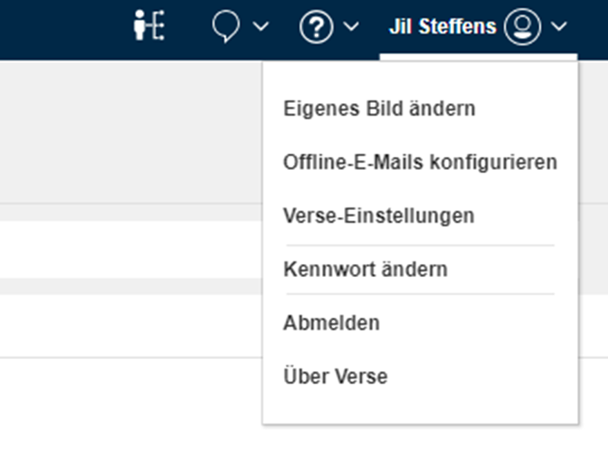

# Anleitung zur Erstanmeldung in Sametime und App Installierung  

## Ersteinstieg
- [Rufen Sie im Internet unsere Homepage](https://sametime.inlakech.de/login) auf
- Benutzername: Vor- und Nachname Initiales Passwort: inlakech
- ![alt text]hcl-knowledgebase/resources/Image-erstanmeldung-ST.png

## Passwort ändern

- Nach der Erstanmeldung muss das Passwort in den Einstellungen geändert werden.

Hierfür öffne das Dropdown Feld unter deinem Benutzernamen und Klicke auf „Kennwort ändern“

- [YouTube: HCL Verse Tutorials](https://www.youtube.com/results?search_query=HCL+Verse+tutorials)

## Community und Foren
- [HCL Community Forum](https://community.hcltechsw.com/)

## Support
- [HCL Verse Support](https://support.hcltechsw.com/csm?id=kb_search&spa=1&query=Verse)

- [HCL Jil Support](https://carstengericke.github.io/hcl-knowledgebase/resources/Jil)
