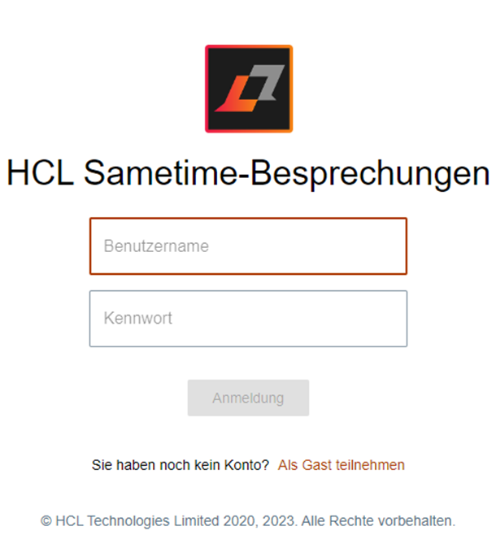
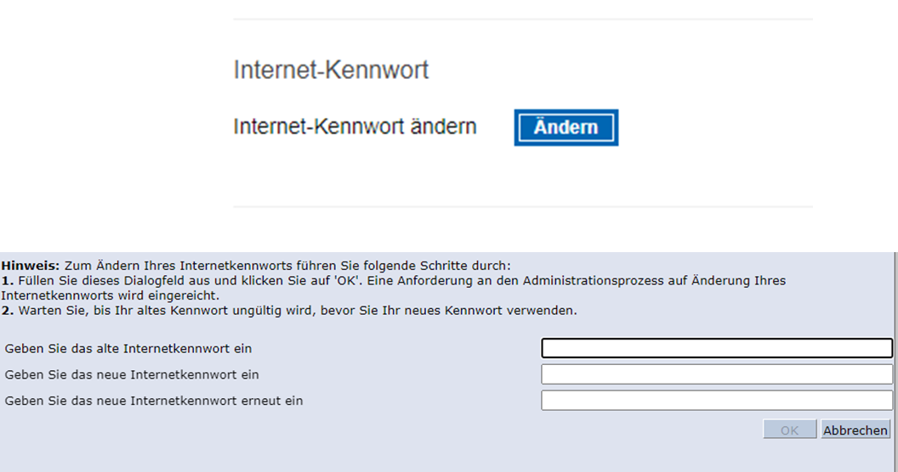
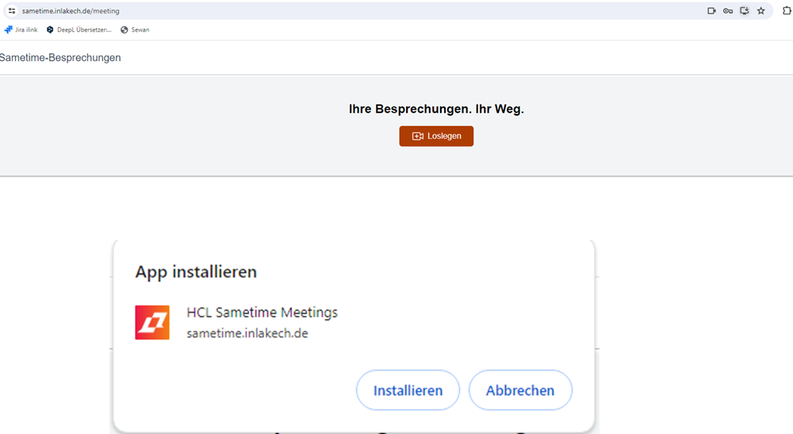

# Anleitung zur Erstanmeldung in Sametime und App Installierung  

## Ersteinstieg
- [Rufen Sie im Internet unsere Homepage](https://sametime.inlakech.de/login) auf
- Benutzername: Vor- und Nachname Initiales Passwort: inlakech
- style="width: 50%;">

## Passwort ändern

- Nach der Erstanmeldung muss das Passwort in den Einstellungen geändert werden.

Hierfür öffne das Dropdown Feld unter deinem Benutzernamen und Klicke auf „Kennwort ändern“

Unter dem Punkt Sicherheit findest du Internet-Kennwort ändern. 
Klicke auf „Ändern“

Als altes Internetkennwort nutzt du: inlakech

Bitte gebe nun dein persönliches 
und sicheres Passwort als neues Passwort ein.

## Sametime Chat
Um auf den Sametime Chat zu gelangen, änder die Webadresse und ersetzte „Meeting“ durch „Chat“

## Sametime App installieren
Auf der Website befindet sich rechts neben der Webadresse folgendes Feld

Bestätige die Installation mit „Installieren“ 

Fertig!
