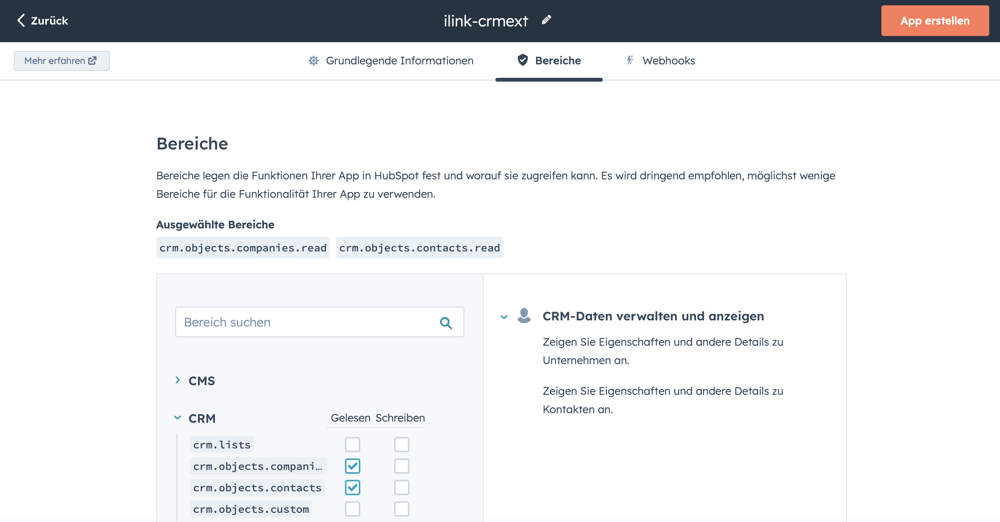

Damit die ilink CRM Extensions auf die Kontakte im Hubspot zugreifen können, benötiget Du ein Zugriffstoken.

Schritt 1: Erstelle eine private App in HubSpot
Melde dich bei deinem HubSpot-Account an und gehe zu den Einstellungen > Integrationen > Private Apps.

Konfiguriere deine App: Gib alle erforderlichen Informationen an, wie Name, Beschreibung, Bereiche (Scopes).

Beim Bereiche (Scopes) sind folgende Werte anzugeben:

* crm.objects.companies Gelesen
* crm.objects.contacts Gelesen

Schritt 2: Erhalte deine App-Informationen
Nachdem du deine private App erstellt hast, erhältst du den Zugriffstoken.

