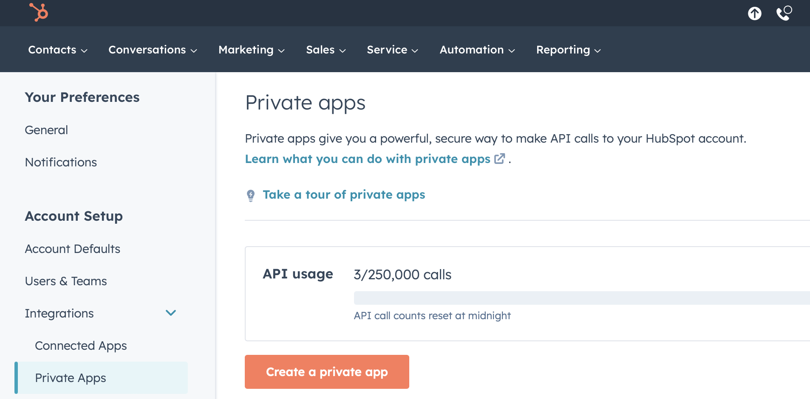
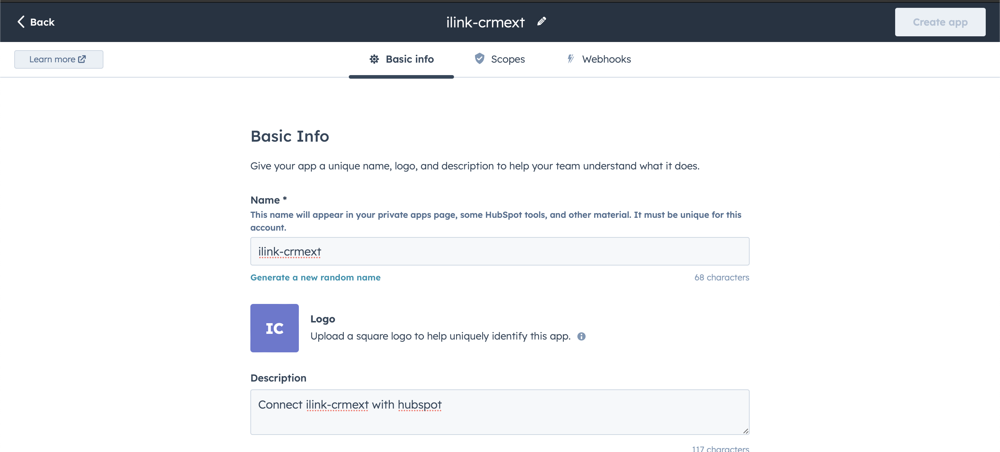
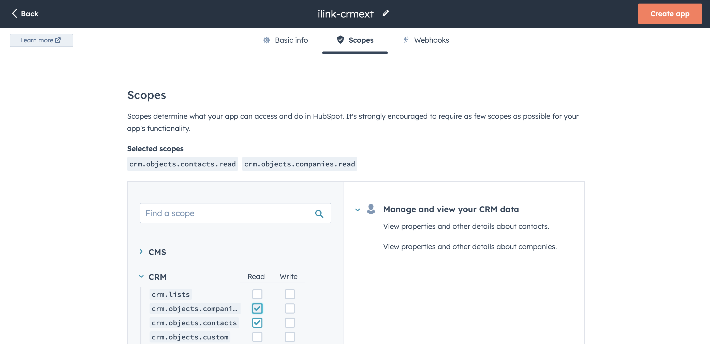
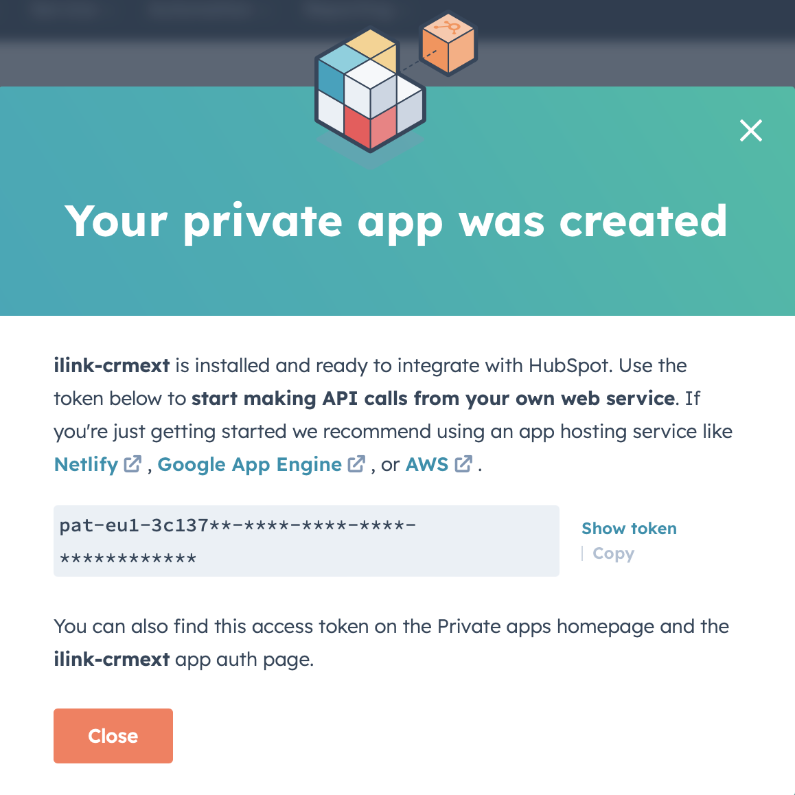
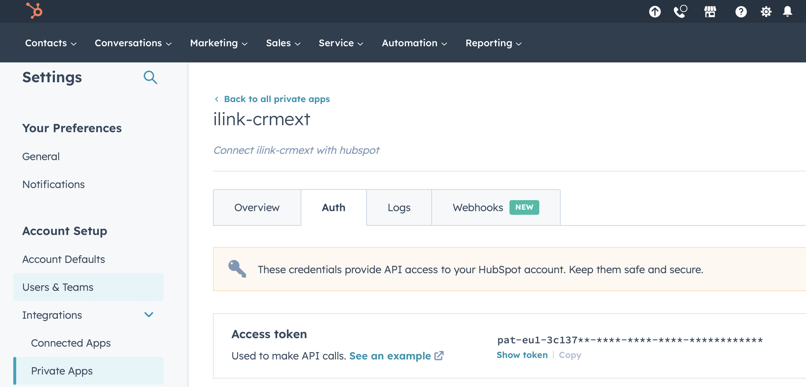

In order for the ilink CRM Extensions to access the contacts in HubSpot, you need an access token.

Step 1: Create a private app in HubSpot
Sign in to your HubSpot account and go to Settings > Integrations > Private Apps.

Configure your app: Provide all required information such as name, description, scopes.

The following values must be specified for the scope:

* crm.objects.companies Read
* crm.objects.contacts Read

Step 2: Get your app information
After you create your private app, you will receive the access token.

